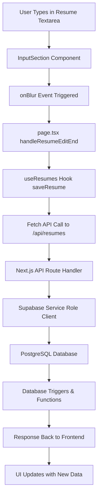

# Frontend to Database Data Flow

This document traces how data flows from your frontend React components to your Supabase database, using **resume saving** as a concrete example.

## 🔄 Complete Data Flow Path



## 📋 Step-by-Step Breakdown

### 1. **Frontend User Interaction**
**Location**: `app/components/InputSection.tsx`

```typescript
// User interacts with the resume textarea
<textarea
  id="resumeLatex"
  value={resumeLatex}
  onChange={(e) => setResumeLatex(e.target.value)}
  onBlur={handleResumeBlur}  // 🎯 This triggers the save flow
  onFocus={() => setIsEditingResume(true)}
  // ... other props
/>
```

**What happens**: User types LaTeX content and clicks away (onBlur event)

---

### 2. **Component Event Handler**
**Location**: `app/components/InputSection.tsx` (lines 56-61)

```typescript
const handleResumeBlur = () => {
  if (resumeLatex.trim()) {
    setIsEditingResume(false);
    onResumeEditEnd(resumeLatex);  // 🎯 Calls parent component
  }
};
```

**What happens**: Local state updates and calls parent component's callback

---

### 3. **Parent Component Logic**
**Location**: `app/page.tsx` (lines 86-104)

```typescript
const handleResumeEditEnd = async (latexContent: string) => {
  if (user && latexContent.trim()) {
    try {
      if (primaryResume) {
        // Update existing primary resume
        await saveResume(
          primaryResume.title,
          latexContent.trim(),
          true, // Keep it as primary
          primaryResume.id
        );
      } else {
        // Create new primary resume if none exists
        await saveResume(
          'My Resume',
          latexContent.trim(),
          true // Set as primary
        );
      }
    } catch (error) {
      console.error('Failed to save resume:', error);
    }
  }
};
```

**What happens**: Determines whether to create new or update existing resume, then calls the `saveResume` function

---

### 4. **React Hook (Data Layer)**
**Location**: `app/hooks/useResumes.ts` (lines 53-109)

```typescript
const saveResume = async (
  title: string,
  latexContent: string,
  isPrimary: boolean = false,
  resumeId?: string
): Promise<UserResume | null> => {
  if (!user) {
    setError('User not authenticated');
    return null;
  }

  try {
    const { data: { session } } = await supabase.auth.getSession();
    const authHeaders: Record<string, string> = {
      'Content-Type': 'application/json',
    };
    
    if (session?.access_token) {
      authHeaders['Authorization'] = `Bearer ${session.access_token}`;  // 🎯 Auth token
    }

    const response = await fetch('/api/resumes', {  // 🎯 API call
      method: 'POST',
      headers: authHeaders,
      body: JSON.stringify({
        title,
        latexContent,
        isPrimary,
        resumeId,
      }),
    });

    const data = await response.json();
    
    if (!response.ok) {
      throw new Error(data.error || 'Failed to save resume');
    }

    await fetchResumes();  // 🎯 Refresh data
    return data.resume;
    
  } catch (err) {
    setError(err instanceof Error ? err.message : 'An error occurred');
    return null;
  }
};
```

**What happens**: 
- Gets user's authentication session from Supabase client
- Makes HTTP POST request to Next.js API route
- Includes Bearer token for authentication
- Handles response and refreshes local data

---

### 5. **Authentication Context**
**Location**: `app/lib/supabaseClient.ts`

```typescript
import { createClient } from '@supabase/supabase-js'

const supabaseUrl = process.env.NEXT_PUBLIC_SUPABASE_URL
const supabaseAnonKey = process.env.NEXT_PUBLIC_SUPABASE_ANON_KEY

export const supabase = createClient(supabaseUrl, supabaseAnonKey)  // 🎯 Client-side client
```

**What happens**: Frontend uses **anon key** client to get user session and access token

---

### 6. **Next.js API Route Handler**
**Location**: `app/api/resumes/route.ts` (lines 67-160)

```typescript
export async function POST(request: NextRequest) {
  try {
    const { title, latexContent, isPrimary, resumeId } = await request.json();

    // 🎯 Extract Bearer token from request headers
    const authHeader = request.headers.get('authorization');
    const accessToken = authHeader.substring(7);
    
    // 🎯 Verify authentication using SERVICE ROLE client
    const { data: { user }, error: authError } = await supabase.auth.getUser(accessToken);
    
    if (authError || !user) {
      return NextResponse.json({ error: 'Invalid token' }, { status: 401 });
    }

    // 🎯 Prepare data for database
    const resumeData = {
      user_id: user.id,
      title: title.trim() || 'My Resume',
      latex_content: latexContent,
      is_primary: isPrimary || false,
      updated_at: new Date().toISOString()
    };

    let result;
    
    if (resumeId) {
      // 🎯 UPDATE existing resume
      const { data, error } = await supabase
        .from('user_resumes')
        .update(resumeData)
        .eq('id', resumeId)
        .eq('user_id', user.id)
        .select()
        .single();
      result = data;
    } else {
      // 🎯 INSERT new resume
      const { data, error } = await supabase
        .from('user_resumes')
        .insert(resumeData)
        .select()
        .single();
      result = data;
    }

    return NextResponse.json({ resume: result });
    
  } catch (error) {
    return NextResponse.json({ error: 'Failed to save resume' }, { status: 500 });
  }
}
```

**What happens**:
- Receives HTTP POST request with resume data
- Extracts and validates Bearer token from Authorization header
- Uses **service role key** client to verify user and bypass RLS
- Performs database INSERT or UPDATE operation
- Returns success/error response

---

### 7. **Server-Side Supabase Client**
**Location**: `app/api/resumes/route.ts` (lines 6-16)

```typescript
// Create Supabase client using service role key to bypass RLS
const supabase = createClient(
  process.env.NEXT_PUBLIC_SUPABASE_URL || '',
  process.env.SUPABASE_SERVICE_ROLE_KEY || '',  // 🎯 SERVICE ROLE KEY
  {
    auth: {
      autoRefreshToken: false,
      persistSession: false
    }
  }
);
```

**What happens**: Server uses **service role key** which has admin privileges and bypasses Row Level Security

---

### 8. **Database Operations**
**Location**: Supabase PostgreSQL Database

**INSERT Operation** (new resume):
```sql
INSERT INTO user_resumes (
  user_id, 
  title, 
  latex_content, 
  is_primary, 
  updated_at
) VALUES (
  'user-uuid-here',
  'My Resume',
  'LaTeX content here...',
  true,
  '2024-01-15T10:30:00Z'
)
RETURNING *;
```

**UPDATE Operation** (existing resume):
```sql
UPDATE user_resumes 
SET 
  title = 'My Resume',
  latex_content = 'Updated LaTeX content...',
  is_primary = true,
  updated_at = '2024-01-15T10:30:00Z'
WHERE 
  id = 'resume-uuid-here' 
  AND user_id = 'user-uuid-here'
RETURNING *;
```

**What happens**: Database executes SQL operations and triggers any associated functions

---

### 9. **Database Triggers & Functions**
**Location**: `supabase_SQL/RESUME_STORAGE_SETUP.sql` (lines 47-58)

```sql
-- Function to ensure only one primary resume per user
CREATE OR REPLACE FUNCTION handle_primary_resume()
RETURNS TRIGGER AS $$
BEGIN
  -- If this resume is being set as primary, unmark all others for this user
  IF NEW.is_primary = TRUE THEN
    UPDATE user_resumes 
    SET is_primary = FALSE 
    WHERE user_id = NEW.user_id AND id != NEW.id;
  END IF;
  
  RETURN NEW;
END;
$$ LANGUAGE plpgsql SECURITY DEFINER;

-- Trigger to enforce single primary resume
CREATE TRIGGER on_resume_primary_update
  BEFORE INSERT OR UPDATE ON user_resumes
  FOR EACH ROW EXECUTE FUNCTION handle_primary_resume();
```

**What happens**: Database triggers automatically ensure business logic (only one primary resume per user)

---

### 10. **Response Journey Back**
**Path**: Database → API Route → React Hook → UI Components

1. **Database** returns inserted/updated record
2. **API Route** sends JSON response with resume data
3. **React Hook** receives response and calls `fetchResumes()` to refresh data
4. **Components** re-render with updated state

---

## 🔐 Authentication Flow

### Frontend Authentication
```typescript
// 1. User session managed by client-side Supabase client
const { data: { session } } = await supabase.auth.getSession();

// 2. Access token sent to API
authHeaders['Authorization'] = `Bearer ${session.access_token}`;
```

### Backend Authentication
```typescript
// 3. API extracts token and verifies with service role client
const accessToken = authHeader.substring(7);
const { data: { user }, error } = await supabase.auth.getUser(accessToken);

// 4. Service role client bypasses RLS for database operations
```

## 🔑 Key Components Summary

| Component | Purpose | Authentication Method | Database Access |
|-----------|---------|----------------------|-----------------|
| **Frontend Components** | User interaction & UI | Anon key + user session | None (via API only) |
| **React Hooks** | Data management & API calls | Bearer token in headers | None (via API only) |
| **Next.js API Routes** | Server-side business logic | Service role key | Direct with admin privileges |
| **Supabase Client (Frontend)** | Authentication & session | Anon key | RLS-protected queries |
| **Supabase Client (Backend)** | Admin operations | Service role key | Bypass RLS entirely |
| **PostgreSQL Database** | Data persistence | N/A | Executes SQL + triggers |

## 🛡️ Security Layers

1. **Client-side**: Anon key respects Row Level Security policies
2. **API Routes**: Service role key + manual authentication checks
3. **Database**: RLS policies, triggers, and constraints
4. **Network**: HTTPS encryption and JWT tokens

This architecture ensures secure, scalable data flow while maintaining clear separation of concerns between frontend, API, and database layers. 